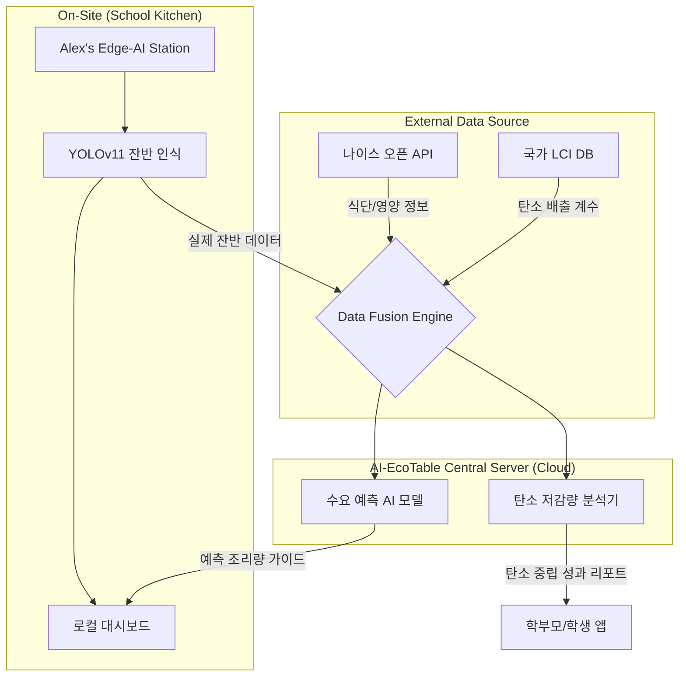

# [기술 명세] AI-EcoTable 시스템 아키텍처 및 서비스 흐름

본 문서는 AI-EcoTable의 데이터 흐름과 기술적 구성을 시각화하여 기획서의 신뢰도를 높이기 위해 작성되었습니다.

---

## 1. 시스템 아키텍처 (System Architecture)

---

## 2. 서비스 프로세스 흐름도 (Service Flow)

### 2.1. 급식 전 (Pre-Lunch)
1. **데이터 수집**: 매일 오전, 나이스 API를 통해 오늘의 메뉴 데이터를 자동으로 가져옵니다.
2. **선호도 예측**: 과거 잔반 데이터를 바탕으로 AI가 오늘의 메뉴별 예상 잔반율을 계산합니다.
3. **조리 최적화**: 영양사 선생님께 "오늘의 제육볶음은 평소보다 5% 적게 조리하셔도 충분합니다"라는 가이드를 제공합니다.

### 2.2. 급식 중 (During-Lunch)
1. **실시간 스캔**: 학생들이 퇴식구에 설치된 **Alex's Edge-AI Station**에 식판을 올립니다.
2. **AI 분석**: YOLOv11 모델이 식판 이미지를 분석하여 밥, 국, 반찬별 잔반량을 0.1g 단위로 추정합니다.
3. **피드백**: 학생용 모니터에 "오늘 쌀밥을 다 드셔서 탄소 0.5kg을 줄이셨어요! 🌲"라는 응원 메시지를 띄웁니다.

### 2.3. 급식 후 (Post-Lunch)
1. **성과 분석**: 전체 잔반 데이터와 탄소 배출 계수를 결합하여 학교 전체의 탄소 저감 성과를 산출합니다.
2. **리포트 발행**: 학부모용 앱으로 "우리 아이 학교가 오늘 줄인 탄소량" 알림을 발송합니다.
3. **모델 학습**: 오늘의 결과 데이터를 중앙 서버로 전송(익명화)하여 예측 모델을 고도화합니다.

---

## 3. 하드웨어 구성 요소 (Alex's Specialization)
- **Control Unit**: Jetson Nano (Edge AI Inference 최적화)
- **Vision Sensor**: OAK-D-Lite (고해상도 Depth 카메라, 입체적 잔반량 측정 가능)
- **Communication**: Wi-Fi 6 / LTE (학교 보안망 우회 및 안정적 전송)
- **PCB**: 전원 노이즈 필터링 및 급식실 습기 방지 코팅이 적용된 Alex 전용 설계 보드
